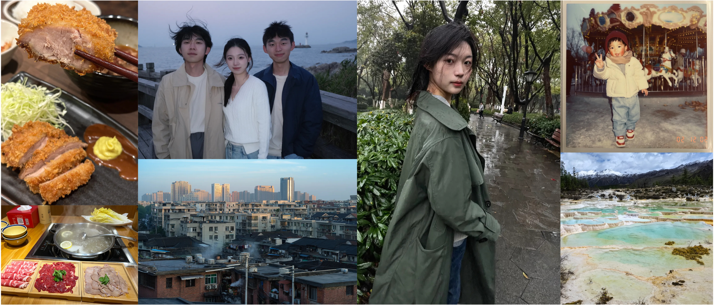
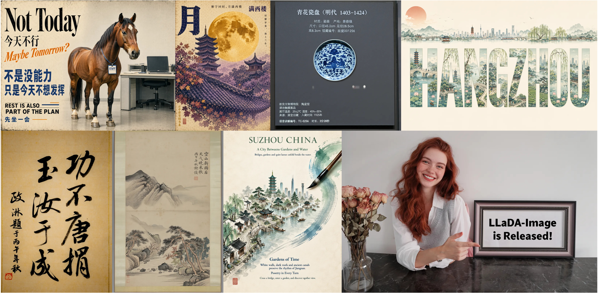
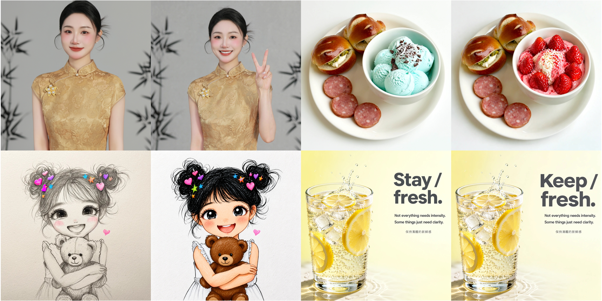
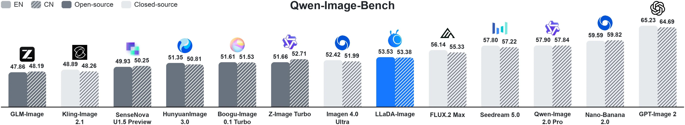

<h1 align="center">LLaDA-Image: Building Strong Image Generators with Fully Open Training Recipes</h1>

<p align="center">
  Welcome to the official repository for LLaDA-Image, a unified model for high-quality image generation and editing.
</p>

<p align="center">
  <a href="https://github.com/inclusionAI/LLaDA-Image"></a>
    <a href="https://arxiv.org/pdf/2609.03796"></a><br>
  <a href="https://huggingface.co/inclusionAI/LLaDA-Image"></a>
  <a href="https://huggingface.co/inclusionAI/LLaDA-Image-FP8"></a>
  <a href="https://huggingface.co/inclusionAI/LLaDA-Image-Turbo"></a>
  <a href="https://huggingface.co/inclusionAI/LLaDA-Image-Turbo-FP8"></a><br>
    <a href="https://modelscope.cn/models/inclusionAI/LLaDA-Image"></a>
  <a href="https://modelscope.cn/models/inclusionAI/LLaDA-Image-FP8"></a>
  <a href="https://modelscope.cn/models/inclusionAI/LLaDA-Image-Turbo"></a>
  <a href="https://modelscope.cn/models/inclusionAI/LLaDA-Image-Turbo-FP8"></a>
</p>

<p align="center">
  
  <br>
  <em>Photorealistic image generation with natural lighting, lifelike details, and coherent scenes.</em>
</p>

<p align="center">
  
  <br>
  <em>High-quality text rendering and creative poster generation across diverse visual styles.</em>
</p>

<p align="center">
  
  <br>
  <em>Instruction-guided image editing with faithful content preservation and precise visual changes.</em>
</p>

## Introduction

LLaDA-Image is a competitive 6B-parameter open-source unified image generation and editing model family. It includes **LLaDA-Image**, a 50-step Base model for high-quality text-to-image generation and instruction-guided editing, and **LLaDA-Image-Turbo**, a 4-step distilled model for fast generation and editing. Both variants support practical text-to-image generation, VQ-conditioned generation, reference-image editing, and Chinese--English text rendering.

This repository provides the checkpoints and Diffusers-based inference code for the LLaDA-Image model family.

## News

- **2026-09-04:** We released the LLaDA-Image Base and Turbo checkpoints together with the inference code.

## Highlights

- **Unified generation and editing.** A single checkpoint supports text-to-image generation and reference-preserving, instruction-guided editing without a separate editing backbone.
- **Unified diffusion model.** Both backbone and DiT are diffusion models, trained in a unified framework.
- **Realistic image generation.** LLaDA-Image produces high-quality images with rich visual details, natural lighting, and coherent compositions.
- **Image-only pre-training for visual-prior learning.** The report establishes the visual prior through image-only pre-training and mid-training before introducing paired language supervision and joint generation--editing training.
- **Efficient inference with distilled model.** LLaDA-Image-Turbo uses Twin-DMD distillation to deliver fast image generation and editing in only 2--4 sampling steps.
- **SOTA on Qwen-Image-Bench.** LLaDA-Image achieves state-of-the-art overall scores of 53.53 in English and 53.38 in Chinese.

<p align="center">
  
</p>

## Model Zoo

| Model                 | Description                                                                           | Sampling steps | Hugging Face (Checkpoints)                                                                    | ModelScope (Checkpoints)                                                                          |
| --------------------- | ------------------------------------------------------------------------------------- | -------------: | --------------------------------------------------------------------------------------------- | --------------------------------------------------------------------------------------------- |
| **LLaDA-Image**       | Base model for high-fidelity text-to-image generation and instruction-guided editing. |             50 | **BF16:** [inclusionAI/LLaDA-Image](https://huggingface.co/inclusionAI/LLaDA-Image)<br>**FP8:** [inclusionAI/LLaDA-Image-FP8](https://huggingface.co/inclusionAI/LLaDA-Image-FP8) | **BF16:** [inclusionAI/LLaDA-Image](https://modelscope.cn/models/inclusionAI/LLaDA-Image)<br>**FP8:** [inclusionAI/LLaDA-Image-FP8](https://modelscope.cn/models/inclusionAI/LLaDA-Image-FP8) |
| **LLaDA-Image-Turbo** | Distilled model for fast generation and editing.                                      |              4 | **BF16:** [inclusionAI/LLaDA-Image-Turbo](https://huggingface.co/inclusionAI/LLaDA-Image-Turbo)<br>**FP8:** [inclusionAI/LLaDA-Image-Turbo-FP8](https://huggingface.co/inclusionAI/LLaDA-Image-Turbo-FP8) | **BF16:** [inclusionAI/LLaDA-Image-Turbo](https://modelscope.cn/models/inclusionAI/LLaDA-Image-Turbo)<br>**FP8:** [inclusionAI/LLaDA-Image-Turbo-FP8](https://modelscope.cn/models/inclusionAI/LLaDA-Image-Turbo-FP8) |

## Opensource Plan

- [x] Inference code and model weights
- [ ] Training code (coming soon)

## Quick Start

### 1. Create an environment

The implementation has been used with Python 3.11, PyTorch 2.8, Transformers 4.57.6, and Diffusers 0.39.0.

```bash
git clone https://github.com/inclusionAI/LLaDA-Image.git
cd LLaDA-Image

conda create -n llada-image python=3.11 -y
conda activate llada-image

pip install -r requirements.txt
```

### 2. Run inference

The pipeline accepts a prompt and, for editing, an optional reference image.

#### LLaDA-Image (Base)

Use the Base checkpoint for high-fidelity generation and editing. Its recommended sampling configuration is **50 steps**.

```python
import torch

from src import LLaDAImagePipeline

# Load the pipeline. The model is downloaded from Hugging Face on first use.
pipe = LLaDAImagePipeline.from_pretrained(
    "inclusionAI/LLaDA-Image",
    torch_dtype=torch.bfloat16,
    device="cuda",
)

# Generate an image.
prompt = (
    "A cinematic photograph of a red fox standing in fresh snow, "
    "soft winter light, detailed fur, shallow depth of field"
)
negative_prompt = ""

image = pipe(
    prompt=prompt,
    negative_prompt=negative_prompt,
    generation_mode="text",
    height=1024,
    width=1024,
    num_inference_steps=50,
    guidance_scale=5.0,
    generator=torch.Generator("cuda").manual_seed(42),
).images[0]

image.save("llada-image-base.png")
```

#### LLaDA-Image-Turbo

Use the Turbo checkpoint for fast generation and editing. Its recommended sampling configuration is **4 steps**.

```python
import torch

from src import LLaDAImagePipeline

# Load the distilled Turbo checkpoint.
pipe = LLaDAImagePipeline.from_pretrained(
    "inclusionAI/LLaDA-Image-Turbo",
    torch_dtype=torch.bfloat16,
    device="cuda",
)

prompt = "A quiet observatory above a sea of clouds at sunrise, golden light, wide-angle photograph"

image = pipe(
    prompt=prompt,
    generation_mode="text",
    height=1024,
    width=1024,
    num_inference_steps=4,
    guidance_scale=1.0,
    generator=torch.Generator("cuda").manual_seed(42),
).images[0]

image.save("llada-image-turbo.png")
```

#### Generation modes

Both checkpoints support the following modes. Text and VQ-conditioned generation require height and width divisible by 16; image editing requires dimensions divisible by 32.

**VQ-conditioned generation** uses the LLaDA2 model to produce image VQ tokens from the prompt, which SigVQ embeds before diffusion. Do not provide an input image in VQ mode.

```python
image = pipe(
    prompt="A quiet observatory above a sea of clouds at sunrise",
    generation_mode="vq",
    height=1024,
    width=1024,
    num_inference_steps=50,  # Use 4 for LLaDA-Image-Turbo.
    guidance_scale=5.0,  # Use 1.0 for few-step inference.
    generator=torch.Generator("cuda").manual_seed(42),
).images[0]
```

**Image editing** requires a reference image:

```python
from diffusers.utils import load_image

reference_image = load_image("/path/to/input.png")
image = pipe(
    prompt="Turn it into a watercolor painting",
    image=reference_image,
    generation_mode="editing",
    height=1024,
    width=1024,
    num_inference_steps=50,  # Use 4 for LLaDA-Image-Turbo.
    guidance_scale=5.0,  # Use 1.0 for few-step inference.
    generator=torch.Generator("cuda").manual_seed(43),
).images[0]
```

## Acknowledgements

We thank the [VeOmni](https://github.com/ByteDance-Seed/VeOmni) project and its contributors for their valuable open-source work.

## Citation

If you find LLaDA-Image useful for your research or applications, please consider citing our work.

```bibtex
@article{LLaDAImage,
title = {LLaDA-Image: Building Strong Image Generators with Fully Open Training Recipes},
author = {Chuyan Chen and Haoxing Chen and Kun Chen and Zhenglin Cheng and Long Cui and Ruishan Fang and Zhangxuan Gu and Zhicheng Huang and Zhenzhong Lan and Yuanting Lei and Haoquan Li and Jianguo Li and Rongchuan Li and Sidu Li and Tao Lin and Deyuan Liu and Jiacheng Liu and Lin Liu and Yuxuan Lou and Zhisheng Lu and Yuxin Ma and Shuheng Shen and Peng Sun and Chaoyang Wang and Hongjun Wang and Xiaomei Wang and Yongxin Wang and Chengzhang Wu and Hongru Wu and Jun Xie},
journal = {arXiv preprint arXiv:2609.03796},
year = {2026}
}
```
